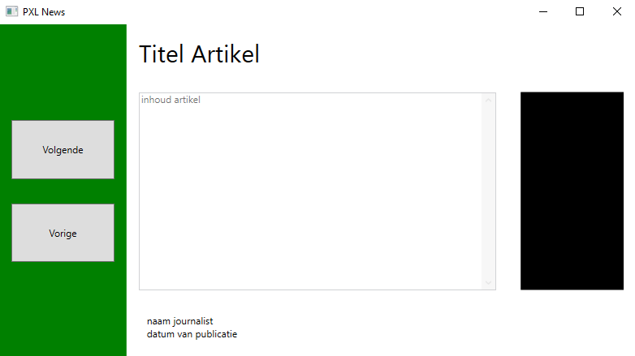
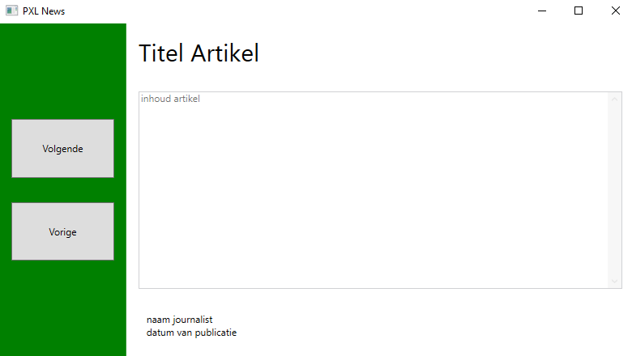
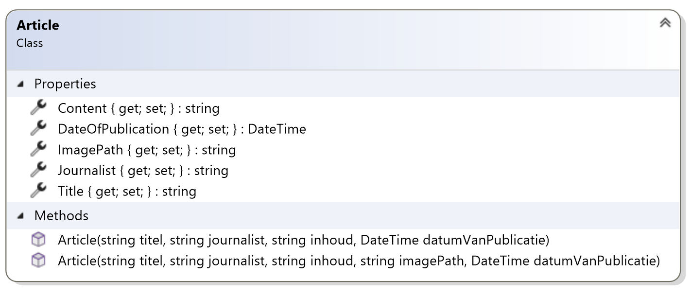
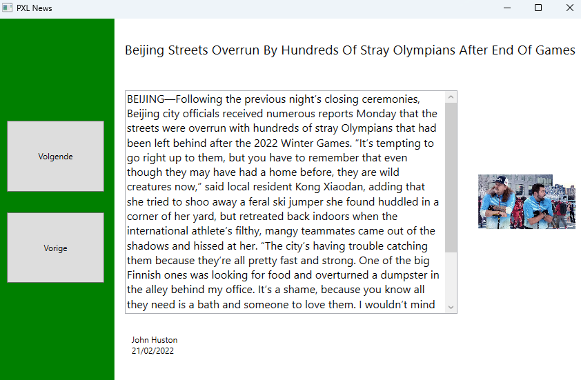
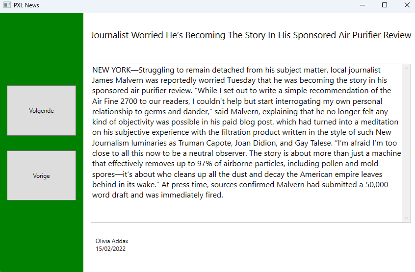

# Classes-6---PXL-News

## Applicatie layout:

Maak een applicatie waarin verschillende nieuwsartikelen getoond worden. Gebruik de bovenstaande layout voor de applicatie. De zwarte rechthoek duidt de plaats aan waar een afbeelding zou verschijnen van het artikel indien er één is toegevoegd.

Indien er geen afbeelding is, dan strekt de tekst van het artikel over de volledige breedte.

Zoek naar drie nieuwsartikelen online om te gebruiken in deze opgave.

## Applicatie vereisten:

- Gebruik een class library om je Article klasse te onderscheiden van de WPF applicatie.
- Maak een klasse Article die je gebruikt om de verschillende artikelen in op te slaan.
- Voorzie een methode CreateArticles() in MainWindow waarin drie nieuwsartikelen worden aangemaakt en in een lijst gestoken.
- Als gebruiker kan ik op de “Volgende”-knop klikken om naar het volgende artikel te navigeren.
- Als gebruiker kan ik op de “Vorige”-knop klikken om naar het vorige artikel te navigeren.
- Voorzie een methode LoadArticle(Article article) in MainWindow die een artikel kan inladen in de layout.
- Voorzie twee constructoren in de klasse Article: één met een image en één zonder een image.

**Klasse Article:**

## Resultaat

Met afbeelding

Zonder afbeelding

